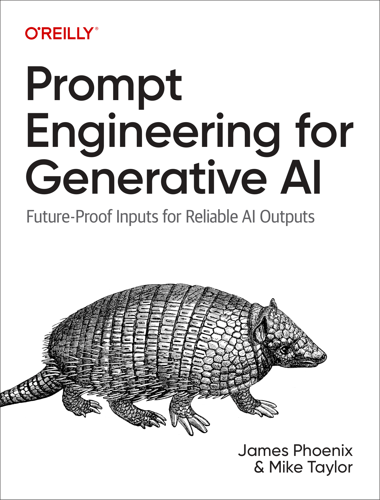

# Prompt Engineering for Generative AI

_Prompt Engineering for Generative AI_ is a comprehensive guide co-authored for O'Reilly, focusing on the art of prompt engineering for GPT-4, Stable Diffusion and other generative AI models. Dive deep into the world of prompt engineering and LLMs (large language models) with our book, which is your ultimate resource for mastering the techniques and methodologies in this rapidly evolving field.

## Content

Access all of the jupyter notebooks and python files within the `content` folder.

## Table of Contents

- _Chapter 1: Five Pillars of Prompting_
    - Giving Direction
    - Specifying Format
    - Providing Examples
    - Evaluating Quality
    - Dividing Labor

- _Chapter 2: Intro to Text Generation Models_
    - What are LLMs?
    - OpenAI’s GPT-4
    - Google’s Bard
    - ... and more

- _Chapter 3: Standard Practices for Text Generation_
    - List Generation
    - Explain It Like I’m Five
    - ... and more

- _Chapter 4: Advanced Techniques for Text Generation with Langchain_
    - Introduction to Langchain
    - Prompt Templates
    - ... and more

- _Chapter 5: Vector Databases_
    - What are Vector Databases?
    - What are Embeddings?
    - ... and more

- _Chapter 6: Autonomous Agents with Memory and Tools_
    - Agents
    - Callbacks
    - ... and more

- _Chapter 7: Intro to Diffusion Models for Image Generation_
    - What are Diffusion models?
    - OpenAI’s DALL-E
    - ... and more

- _Chapter 8: Standard Practices for Image Generation_
    - Art Style Modifiers
    - Meme Unbundling
    - ... and more

- _Chapter 9: Advanced Techniques for Image Generation_
    - Prompt Expansion
    - Meme Mapping
    - ... and more

- _Chapter 10: Building AI-powered Applications_
    - Progressive Text Summarization with Langchain
    - Blog Article Generation
    - ... and more

## Features

- _Practical Examples_: Illustrative real-world examples to showcase prompt engineering techniques.
- _In-depth Analysis_: Comprehensive coverage of each topic, offering foundational knowledge and advanced insights.
- _Expert Guidance_: Insights from leading experts in AI and prompt engineering.

## Audience

Ideal for AI Researchers, Data Scientists, Software Developers, Tech Enthusiasts, and anyone interested in AI and prompt engineering.

## Feedback

Your feedback is valuable! Please share your thoughts and suggestions at [james@brightpool.dev](mailto:james@brightpool.dev) or [mike@brightpool.dev](mailto:mike@brightpool.dev)
